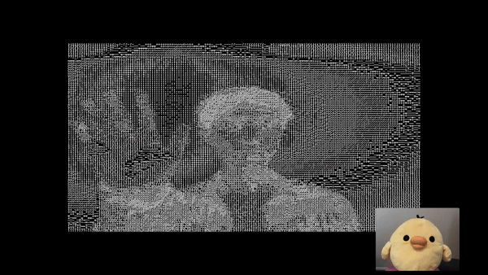

# Ascii Stream
No more laggy video calls! Ascii Stream uses ASCII art instead of video to save on bandwith.

2nd Best Overall Hack for IvyHacks 2020.

# How It Works
Instead of streaming video for video calling, Ascii Stream streams ASCII art as text, which takes up less space than video. It uses PeerJs (an open-source wrapper around WebRTC) to handle sending data between users, and it converts video to ASCII art locally before sending it. Ascii Stream also sends audio between users, so mute your speakers if making two calls on one laptop to prevent audio feedback.

[Try it yourself!](https://ascii-stream.vercel.app/)

